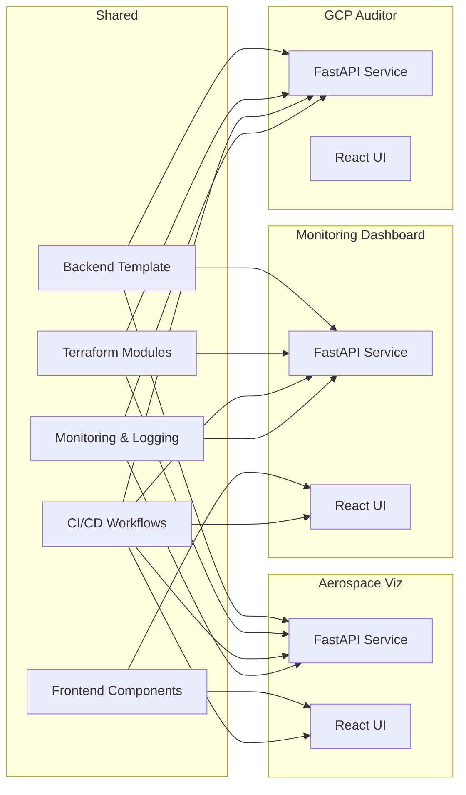

# System Engineering Reference Architecture

Below is a high-level architecture diagram showing the shared components that
all demo projects will consume.


```

Each project imports or extends the shared modules instead of duplicating code.

